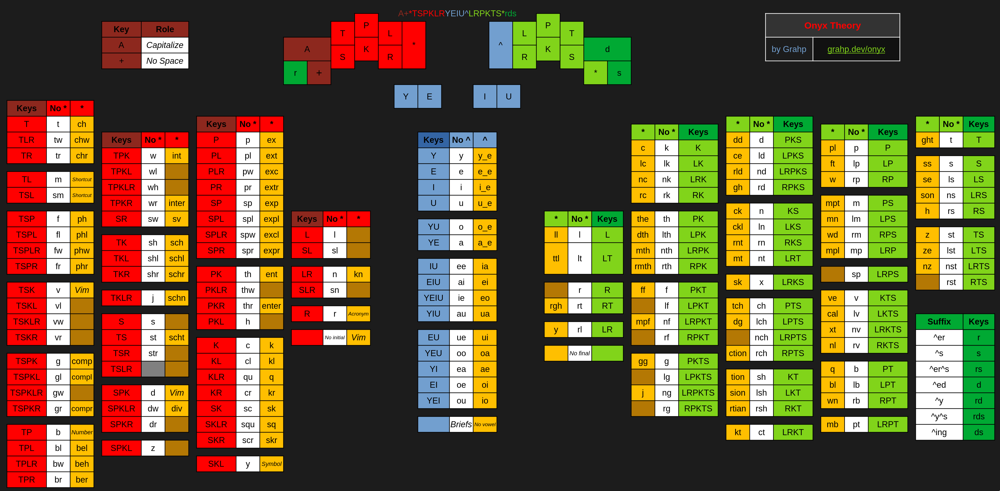
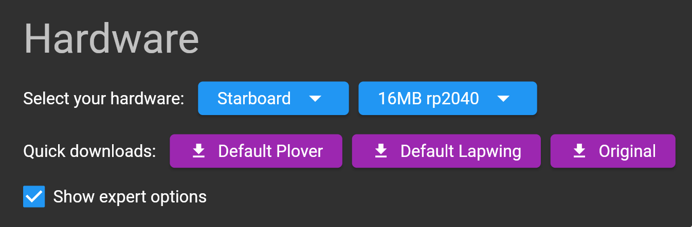
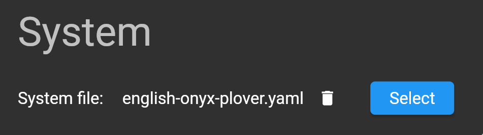
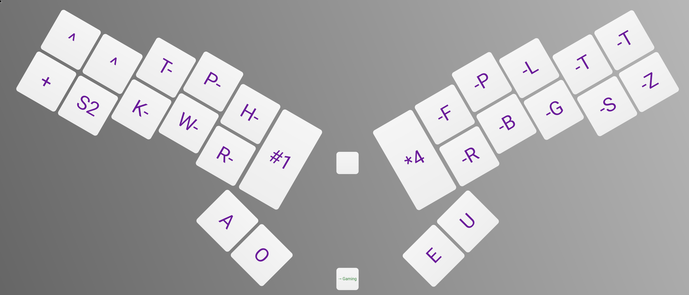
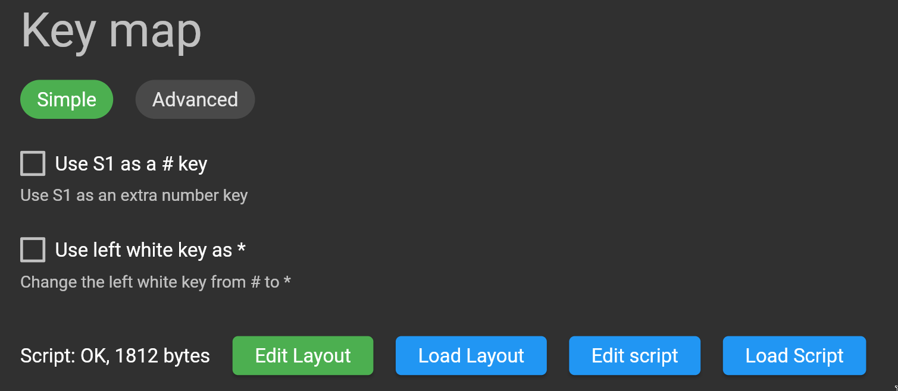

# Onyx Layout Javelin System

[Javelin](https://lim.au/#/software/javelin-steno) System / Layout for [Onyx](https://github.com/Grahp/Onyx).

If you're using Plover, see https://github.com/Grahp/plover-onyx-layout

## Layout Diagram

## Setup

> [!WARNING]
> You should always back up your User Dictionary before switching systems on Javelin!

In the `Hardware` section of the [Javelin Firmware Builder](https://lim.au/#/software/javelin-steno), enable `Show expert options`.

In the `System` section of the firmware builder, select the `english-onyx-plover.yaml` file as your system file.

Make sure your layout looks like this:

Your layout can be changed in the [Javelin Key Layout Tool](https://lim.au/#/software/javelin-steno-tools/key-layout) after you have flashed your firmware, or by pressing `Edit Layout` in the `Key map` section of the firmware builder.

